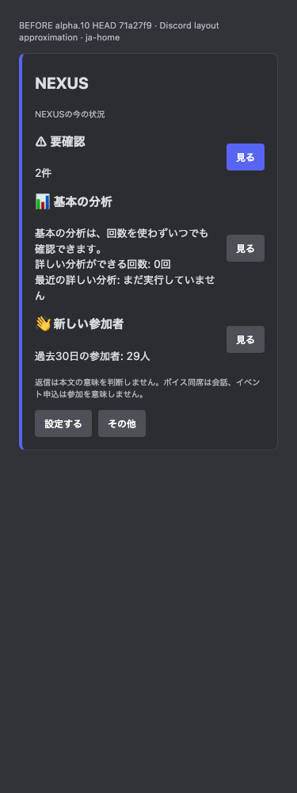
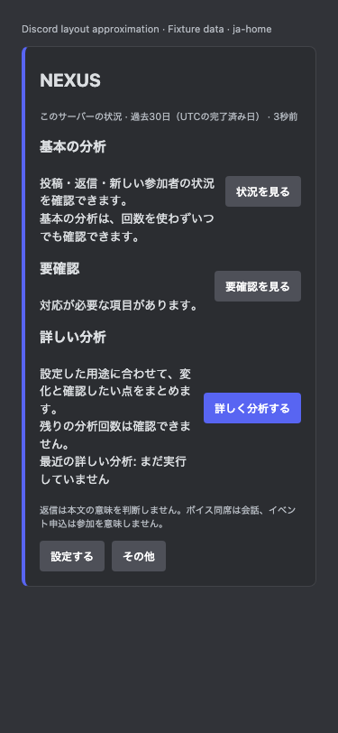

# alpha.10 Discord UI review artifacts

These artifacts are **actual generated Components V2 message payloads with synthetic fixture data**, rendered by the repository's local HTML approximation. **Live Discord acceptance: NOT RUN.** No Discord server, channel, role, public panel or payment service was changed to produce them. The JSON `custom_id` values are non-deployable fixture references; production still issues signed server-side component tokens.

The before payloads come from immutable commit `71a27f937e8dd534c40c767033d91a492cdce44c`, extracted with `git archive` into a temporary directory. Its original panel implementation generated the before JSON. Before and after images use the same local approximation styles and 375px mobile / 700px desktop widths. They show component structure and text wrapping; they do not certify native Discord behavior.

Full local generation: **138 payload cases, 276 screenshots**; this folder contains 32 selected JSON files and eight PNGs. [manifest.json](manifest.json) records SHA-256 hashes. Japanese and English cases include home, current observed results, history navigation, the S7 330-channel census draft, its last page, a separate 230-place long-name review, zero allowance, verified zero, legacy/no data, missing permissions, a free calculation correction and partial historical post coverage. Counts and dates are fictional. A current result has five observed metrics, three shown initially, saved targets/calculation time and two baseline changes; the legacy/no-data result remains separate.

| Image | Review focus |
| --- | --- |
| [Before Japanese mobile home](images/before-ja-home-mobile.png) | Original commit behavior |
| [After Japanese mobile home](images/after-ja-home-mobile.png) | Stable entrances, separate free and counted analysis |
| [After English desktop home](images/after-en-home-desktop.png) | English copy and desktop wrapping |
| [Current Japanese mobile result](images/after-ja-current-completed-mobile.png) | Period, target count, calculation time, units, observed changes and three primary measurements |
| [English mobile history next page](images/after-en-history-next-mobile.png) | All five result actions and both navigation directions |
| [English mobile final places page](images/after-en-places-last-mobile.png) | Later selected places remain reachable; long fixture names wrap |
| [Japanese mobile historical result](images/after-ja-historical-result-mobile.png) | Older participant-only post records show a partial count and unknown Bot count |
| [English mobile historical result](images/after-en-historical-result-mobile.png) | Long limitation text fits; unknown Bot count is distinct from verified zero |





Payload pairs use `ja-` and `en-` filenames. `representative-S7-setup.json` contains the final draft summary for a server with 330 channel records, of which 319 non-category places were selected in this synthetic draft. `representative-S7-places-last-page.json` preserves the final nine selected IDs and their purpose labels. This draft includes partial permission coverage; a real confirmation must recheck eligibility and cannot blindly save it. `places-last-page.json` is a distinct 230-place fixture for wrapping unusually long mention labels. Channel mentions resolve to names inside Discord; the approximation substitutes fixed fixture names for selected IDs.

The six `ja-/en-historical-{basic-posts,preview,completed-result}.json` payloads contain the new historical limitation. Their synthetic human-post count is a lower bound of four; their Bot/integration-post count is unknown. They disclose that older records cover only some participants, so staff/Bot-inclusive totals and zero Bot posts cannot be confirmed. This explanation appears before detailed evidence in all three surfaces. These added fixtures preserve all earlier before/after evidence unchanged.

Generate current output without starting application servers:

```sh
corepack pnpm exec playwright test --config playwright.discord.config.ts
```

Default output is `test-results/discord-payloads/*.json` plus `test-results/polish-discord-*.png`. Set `NEXUS_PANEL_EXPORT_DIR` / `NEXUS_DISCORD_SCREENSHOT_DIR` to preserve output elsewhere. The exporter checks recursive components (including accessories), full Text Display totals, select limits, complete custom IDs and action-group Primary limits. Playwright checks horizontal overflow at both widths. Native mention resolution, date formatting, menu opening, modal controls, focus, screen readers, scrolling and REST acceptance remain unverified. The preview renders absolute timestamps in UTC and relative timestamps as localized placeholders.

The full implementation, test record and nine-step manual development-Guild acceptance procedure are in [../alpha10-stabilization-ui.md](../alpha10-stabilization-ui.md). Every live acceptance step remains **NOT RUN**. Live execution requires separately authorized development-Guild access; these local screenshots must not be treated as that authorization or as a live test pass.
