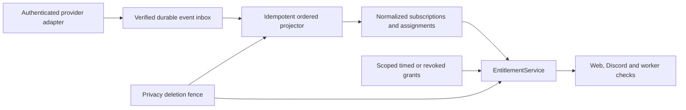

# Billing architecture — alpha.7 commercial foundation

PostgreSQL is canonical. The existing `EntitlementService` is the one server-side
decision boundary for Web, Discord, API presentation and workers. React copy and
Discord buttons describe a decision; they never authorize an operation.

Migration 035 adds accounts, encrypted provider customers/references, immutable
plan versions, offerings, subscriptions, guild assignments, verified provider
events, grants, usage snapshots, guild recovery/rule state, organization billing
authorization and audit. 036 adds campaigns, hashed codes, transactional
redemptions and persistent attempt limits. 037 adds leased reconciliation jobs and
immutable custom recipe keys. Existing usage history is not rewritten.

Providers are STRIPE, DISCORD and MANUAL. Historical generic references are read-only EXTERNAL_LEGACY. The interface separates checkout,
preview, cancellation, reconciliation, verified event parsing and subscription
inspection. STRIPE uses the official server-only SDK when its configuration is
valid; MANUAL and disabled providers fail closed. The Stripe Node.js Webhook
route verifies exact raw-body signatures with that SDK. Generic HMAC is test-only.
See [alpha.7 contracts](billing/contract-hardening-alpha7.md) and
[commerce integration](billing/stripe-integration.md).

`receive` stores adapter-verified Discord events or trusted Stripe signals; it never mutates a
subscription. The projector holds privacy and guild fences, then an account lock
and inbox/subscription row locks. Provider event HMACs deduplicate delivery.
Discord/manual sequence and timestamp reject older events; Stripe uses
RECONCILE_LATEST with internally fenced retrieval revisions. Contradictory equal-order
events become CONFLICT. Failures persist bounded exponential retry scheduling and
an NXS reference so poison events do not monopolize subsequent work. All locks,
leases, retry clocks and states survive process/database restarts.

The resolver supports TRIALING, ACTIVE, PAST_DUE, GRACE, CANCEL_AT_PERIOD_END,
CANCELED, INCOMPLETE, UNKNOWN and CONFLICT. Only authoritative confirmation unlocks
an upgrade. Redirect success or a Store-link click does not. Scheduled downgrades
retain the confirmed plan until authoritative replacement. CANCEL_AT_PERIOD_END
retains confirmed access through the paid end; authoritative CANCELED removes
access immediately. Unknown/unavailable providers preserve
bounded last-known-good access, with a configurable account grace (default 72
hours after the confirmed end; indefinite entitlements use the last successful
confirmation). No prior confirmation means no paid access.

Effective entitlements are the highest valid plan plus scoped feature/limit grant
overlays. IDs and input ordering cannot change the outcome. Contract overrides
only apply to their organization/guild query. Overlapping valid paid allocations
produce BILLING_CONFLICT, apply the higher valid plan temporarily and warn an
authorized administrator. They never double-count usage, charge, cancel or merge
provider subscriptions automatically.

`check(scope, feature)` returns allowed, effectivePlan, source, requiredPlan,
availability, reason and upgrade options, plus limit/usage/reset fields where
applicable. `limit` handles resource allowances; `visibleHistoryDays` constrains
history reads. Raw provider IDs are never feature-gating inputs.

`PlanChangePreview` contains current/target plan, provider, effective time,
features gained/lost, changed limits, history visibility/recovery, configured rules
that pause and allocation impact. It changes nothing. Discord pricing, tax and
proration remain provider-owned; external changes remain unconfigured.

The existing scheduler projects a bounded inbox batch, refreshes entitlement/rule
state and leases Discord census reconciliation per enabled guild. Success schedules
another census in an hour; failure retries after five minutes and preserves known
good state. REST uses the existing Discord rate limiter and bounded pagination.
Renewal metadata and immediate Gateway billing events still need an adapter before
live commercial rollout. See [native billing](discord-premium-apps.md).

All paid workers recheck immediately before a side effect. Downgrade preserves
rule definitions, labels them PAUSED_PLAN_LIMIT and suppresses queued paid writes.
Upgrade allows future eligible runs; old suppressed sends are not replayed blindly.
History recovery is distinct from payment grace and never delays privacy deletion.

## Presentation contract for Web Experience v2

`BillingService.view(scope)` adds one versioned server presentation model to the
canonical billing status. Web and Discord consume its feature decisions, available
and planned feature lists, canonical billingActions, history request bound
and current scoped benefits. `/billing/status` exposes this model after current
OAuth, server verification and billing VIEW authorization, with `no-store`.
`canManage` is separately checked against current billing mutation authority.
The existing same-origin POST `/billing/actions` preview returns
`PlanChangePreview`; it never changes entitlements. Codes, provider references,
private campaign definitions and actor identities are absent from the view.

History query safety (3,650 days) is distinct from catalog/contract visibility and
physical retention. Downgrade recovery preserves eligible retained aggregates,
while the lower current visibility applies immediately. Privacy deletion rejects
history reads even during recovery. CSV row bounds use the same system constant;
invalid Web history ranges return HTTP 400 rather than a provider outage error.
