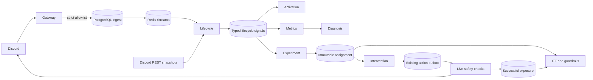

# v0.2 Architecture

既存5 apps / 12 packagesを維持し、001–004の上に追加マイグレーションを適用します。事前調査は[current-state.md](current-state.md)に記録しています。

## 信頼境界

- `organization_id + guild_id`をサービス境界と外部キーに使います。schedulerだけがguild registryを列挙します。
- Gatewayは厳格なschemaで内容を落としてからPostgreSQLに永続化し、Redisへ送信します。未projectedレコードは回復送信します。inboxとsignalの一意制約で重複を抑えます。
- 外部RESTはSQL transactionの外側で行います。副作用を持つworkerはsession advisory lockで削除と配送を排他し、実行前後のDB処理を短いtransactionに分けます。
- 送信後に結果が不明になった操作はUNKNOWNです。勝手に再送したり成功の所有権証跡を作ったりしません。
- HTTP interactionは署名・時刻を検証し、暗号化したdurable jobに記録してACKします。管理操作はlive権限を再認可します。
- Webのguild限定bearer tokenはサーバーのみが保持します。Basic認証と同一originのPOST検査を通した管理画面です。APIトークン自体は管理者credentialです。

## 定義と観測

`guild_config_revisions`はdraft→preview/hash→publish、公開時のhead競合検査、監査を持ちます。公開後はDB triggerで変更を拒否します。Rollbackは旧版を新draftにコピーします。Activationは加入時点の公開版に固定します。旧開始チャンネル定義は011でbackfillします。

DSLはall/any/not、event/count/duration、role、channel、reply、event subscription、flow answer等の型付き条件です。SQL/JavaScriptを実行しません。観測不足や未成熟な否定はunknownです。Activation自身への循環依存を拒否します。

`signalRegistry`を指標のactive判定に使用します。匿名D30 counterのDB triggerに対応するactive allowlistはmigration 012に固定され、変更時は新migrationとmetric versionが必要です。短い詳細保持期間でもD30分母を失わないよう、加入日別匿名件数とepisodeごとの一度限りの加算印を使います。

## 集計

通常画面は直近30日の加入cohortです。D1/D7は成熟窓だけを分母にします。D30だけは直近最大30日分の**完全に成熟したUTC加入日cohort**を匿名counterから表示し、指標自身のwindowに日付を返します。計測導入前のcohortを完全なデータとして扱いません。

CoverageはGateway時間・欠測、Native checkpoint成否、保持期間を考慮します。非表示チャンネル内の行動やDiscordで取得できない操作を観測できるという意味ではありません。公開定義が異なるActivation同士を診断で比較しません。診断は観測的で、因果関係を主張しません。

毎時匿名snapshotを作り、日次行を更新します。実験は成熟時の結果を保存し、詳細イベント期限後も保存済みの成否を利用します。未保存・欠測の結果は推測しません。割付・詳細実験状態を個人削除した場合は再集計の分母も変わり、過去の匿名集計は残ります。

## 運用上の上限

guild workerはbounded drain、Snapshotはlease/retry、最適化対象は250 episodeずつ公平に巡回します。能力情報は有効guildで30分ごとに再取得し、Snapshotは加入時の5 checkpointと活動時の5分bucketで取得します。REST rate-limitに従います。大規模負荷、複数processによる長期運用、実Discordのレート制限下での実績はまだありません。
